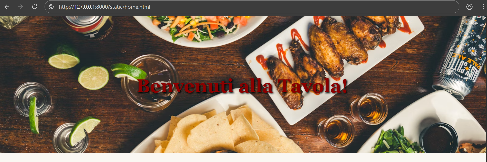
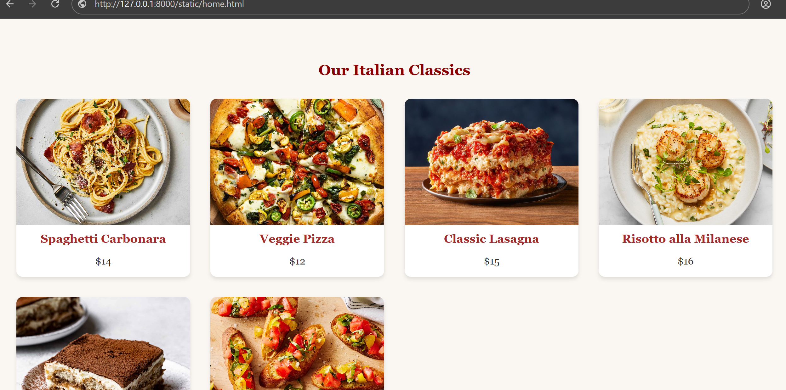
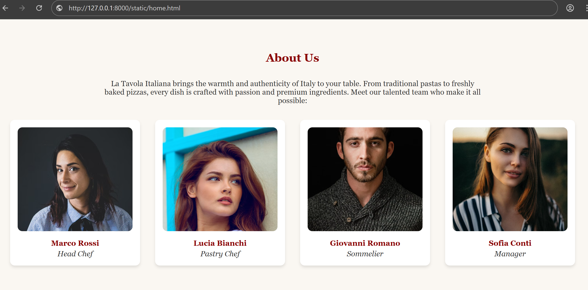
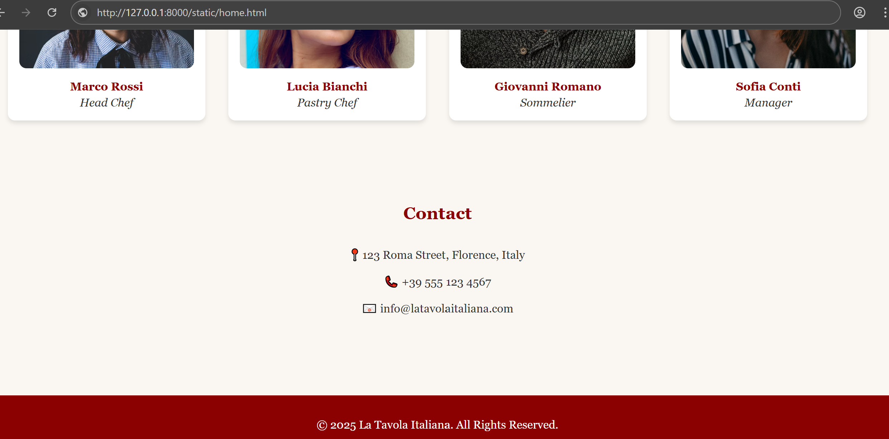

# Ex.07 Restuarant Website
<<<<<<< HEAD
## Date:
=======
## Date:14-11-25
>>>>>>> 38a9883 (success)

## AIM:
To develop a static Resturant website to display the menu and services provided by the resturant.

## DESIGN STEPS:

### Step 1:
Requirement collection.

### Step 2:
Creating the layout using HTML and CSS.

### Step 3:
Updating the sample content.

### Step 4:
Choose the appropriate style and color scheme.

### Step 5:
Validate the layout in various browsers.

### Step 6:
Validate the HTML code.

### Step 7:
Publish the website in the given URL.

## PROGRAM:
<<<<<<< HEAD


## OUTPUT:
=======
```
Home.html:

<!DOCTYPE html>
<html lang="en">
<head>
  <meta charset="UTF-8">
  <meta name="viewport" content="width=device-width, initial-scale=1.0">
  <title>La Tavola Italiana - Home</title>
  <link rel="stylesheet" href="css/style.css">
</head>
<body>
  <header>
    <h1>La Tavola Italiana</h1>
    <p>Authentic Italian Cuisine with Love</p>
  </header>

  <nav>
    <a href="home.html">Home</a>
    <a href="menu.html">Menu</a>
    <a href="admin.html">About</a>
    <a href="contact.html">Contact</a>
  </nav>

  <div class="hero" id="home">
    <h2>Benvenuti alla Tavola!</h2>
  </div>

  <section id="menu">
    <h2>Our Italian Classics</h2>
    <div class="image-row">
      
      
      
      
      
      
    </div>
  </section>

  <footer>
    <p>&copy; 2025 La Tavola Italiana. All Rights Reserved.</p>
  </footer>
</body>
</html>


Menu.html:


<!DOCTYPE html>
<html lang="en">
<head>
  <meta charset="UTF-8">
  <meta name="viewport" content="width=device-width, initial-scale=1.0">
  <title>La Tavola Italiana - Menu</title>
  <link rel="stylesheet" href="css/style.css">
</head>
<body>
  <header>
    <h1>La Tavola Italiana - Menu</h1>
  </header>

  <nav>
    <a href="home.html">Home</a>
    <a href="menu.html">Menu</a>
    <a href="admin.html">About</a>
    <a href="contact.html">Contact</a>
  </nav>

  <main>
    <h2>Food Items</h2>
    <div class="image-row">
      
      
      
      
      
      
    </div>
  </main>

  <footer>
    <p>&copy; 2025 La Tavola Italiana. All Rights Reserved.</p>
  </footer>
</body>
</html>


Admin.html:


<!DOCTYPE html>
<html lang="en">
<head>
  <meta charset="UTF-8">
  <meta name="viewport" content="width=device-width, initial-scale=1.0">
  <title>La Tavola Italiana - About Us</title>
  <link rel="stylesheet" href="css/style.css">
</head>
<body>
  <header>
    <h1>La Tavola Italiana - Our Team</h1>
  </header>

  <nav>
    <a href="home.html">Home</a>
    <a href="menu.html">Menu</a>
    <a href="admin.html">About</a>
    <a href="contact.html">Contact</a>
  </nav>

  <section id="about">
    <h2>About Us</h2>
    <p style="text-align:center; max-width:800px; margin:auto;">
      La Tavola Italiana brings the warmth and authenticity of Italy to your table.
      From traditional pastas to freshly baked pizzas, every dish is crafted with passion and premium ingredients.
      Meet our talented team who make it all possible:
    </p>

    <div class="image-row">
      
      
      
      
    </div>
  </section>

  <footer>
    <p>&copy; 2025 La Tavola Italiana. All Rights Reserved.</p>
  </footer>
</body>
</html>


Contact.html:

<!DOCTYPE html>
<html lang="en">
<head>
  <meta charset="UTF-8">
  <meta name="viewport" content="width=device-width, initial-scale=1.0">
  <title>La Tavola Italiana - Contact</title>
  <link rel="stylesheet" href="css/style.css">
</head>
<body>
  <header>
    <h1>Contact Us</h1>
  </header>

  <nav>
    <a href="home.html">Home</a>
    <a href="menu.html">Menu</a>
    <a href="admin.html">About</a>
    <a href="contact.html">Contact</a>
  </nav>

  <section id="contact">
    <h2>Contact</h2>
    <p style="text-align:center;">📍 123 Roma Street, Florence, Italy</p>
    <p style="text-align:center;">📞 +39 555 123 4567</p>
    <p style="text-align:center;">📧 info@latavolaitaliana.com</p>
  </section>

  <footer>
    <p>&copy; 2025 La Tavola Italiana. All Rights Reserved.</p>
  </footer>
</body>
</html>

```


## OUTPUT:
Home.html:


Menu.html:


Admin.html:


Contact.html:



>>>>>>> 38a9883 (success)


## RESULT:
The program for designing software company website using HTML and CSS is completed successfully.


# Ex.07 Restuarant Website
## Date:

## AIM:
To develop a static Resturant website to display the menu and services provided by the resturant.

## DESIGN STEPS:

### Step 1:
Requirement collection.

### Step 2:
Creating the layout using HTML and CSS.

### Step 3:
Updating the sample content.

### Step 4:
Choose the appropriate style and color scheme.

### Step 5:
Validate the layout in various browsers.

### Step 6:
Validate the HTML code.

### Step 7:
Publish the website in the given URL.

## PROGRAM:


## OUTPUT:


## RESULT:
The program for designing software company website using HTML and CSS is completed successfully.
